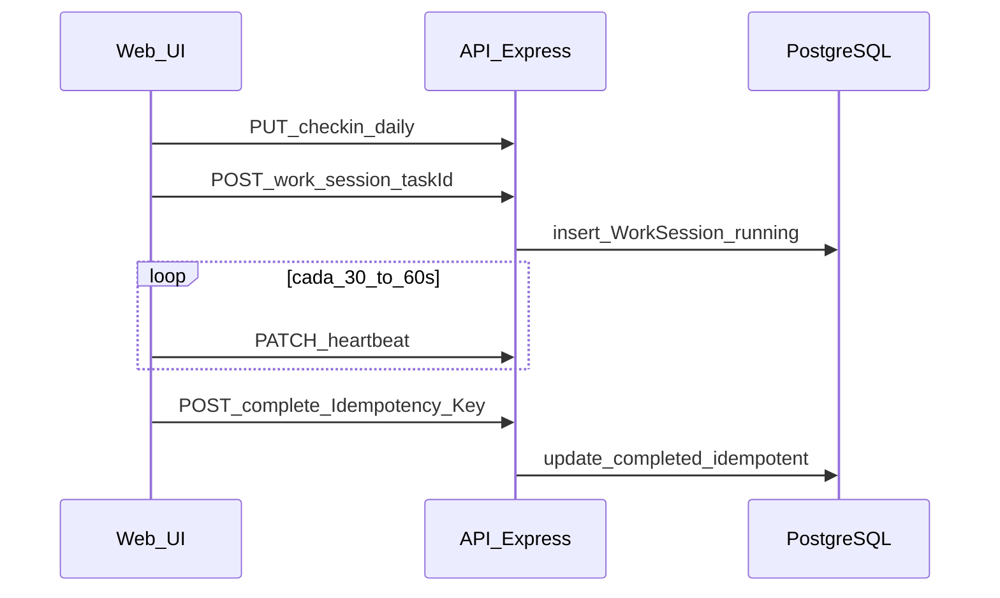

# Registro diario de sesión — plan de implementación

> **Para agentes:** usar **superpowers:subagent-driven-development** (recomendado) o **superpowers:executing-plans** tarea a tarea. Pasos con checkbox `- [ ]`.

> **Flujo de cambios (obligatorio):** **No** hacer `git commit`, **no** hacer `git push` ni subir nada a remoto. El trabajo queda en el árbol de trabajo local como diff listo para **revisión humana** (PR o revisión directa). Tras aprobación explícita, quien revise integra en el historial como corresponda. Sustituye la pauta “commits frecuentes” del skill writing-plans por **checkpoint de revisión entre tareas o al cierre de cada task**.

**Objetivo:** Persistir check-in diario (energía/estrés) y bloques de timer con feedback en PostgreSQL, con gate antes del primer timer, un bloque activo conflictivo con **409**, estados `running` / `paused` / `pending_feedback` / `completed` / `abandoned`, heartbeat, `complete` idempotente y UI (modal + presets).

**Arquitectura:** Extender el modelo Prisma existente en [apps/api/prisma/models/business.prisma](apps/api/prisma/models/business.prisma) (`WorkSession` + nuevo `DailyCheckin`) y enums en [apps/api/prisma/models/enums.prisma](apps/api/prisma/models/enums.prisma). Servicios dedicados (`DailyCheckinService`, `WorkSessionTimerService` o nombre acorde al repo) y rutas Express montadas en [apps/api/src/api/routes/index.ts](apps/api/src/api/routes/index.ts) con **`authenticateToken`** como en [apps/api/src/modules/users/routes.ts](apps/api/src/modules/users/routes.ts) (no replicar el patrón opcional `query userId` de [ActivityController](apps/api/src/modules/activities/controllers/ActivityController.ts)). Cliente: ampliar [apps/web/stores/timer.ts](apps/web/stores/timer.ts) + composables para API (`credentials: 'include'`), gate de check-in, modal único y presets persistidos (p. ej. `secureStorage` + sección ajustes).

**Stack:** Prisma/PostgreSQL, Express, Vitest/supertest, Nuxt/Vue/Pinia, Zod (validación), cookies HttpOnly para auth.

---

## Mapa de archivos (responsabilidades)

| Área         | Crear o modificar                                                                                                                                                                                                                                                                                                                                                                                                                                                                                                                                                                                                                                                                                                                                                                                                                                                                                                                                                                                                                                                                                                                     |
| ------------ | ------------------------------------------------------------------------------------------------------------------------------------------------------------------------------------------------------------------------------------------------------------------------------------------------------------------------------------------------------------------------------------------------------------------------------------------------------------------------------------------------------------------------------------------------------------------------------------------------------------------------------------------------------------------------------------------------------------------------------------------------------------------------------------------------------------------------------------------------------------------------------------------------------------------------------------------------------------------------------------------------------------------------------------------------------------------------------------------------------------------------------------- |
| Prisma       | [apps/api/prisma/models/enums.prisma](apps/api/prisma/models/enums.prisma): `WorkSessionState`, `TimerMode` (pomodoro / ultradian / custom), `TimeFit` (yes/mixed/no), `FrictionBlocker` (opcional, alineado a [apps/web/types/task.ts](apps/web/types/task.ts) `TaskFeedbackBlocker`). [apps/api/prisma/models/business.prisma](apps/api/prisma/models/business.prisma): modelo `DailyCheckin` (`@@map("daily_checkins")`), `@@unique([userId, calendarDate])`, `calendarDate` tipo `DateTime @db.Date`; extender `WorkSession` con `state`, `timerMode`, `targetDurationSec`, `pausedDurationSec`, `lastClientSeenAt`, `dailyCheckinId?`, columnas reflexión 1–5, `timeFit`, `mainBlocker`, `taskId` **obligatorio en creaciones nuevas** (migración: backfill o `SET NOT NULL` solo si no hay filas null — si hay legacy null, usar `@default` temporal + limpieza o dejar opcional hasta migración datos). [apps/api/prisma/models/user.prisma](apps/api/prisma/models/user.prisma): relación `dailyCheckins`. Tabla idempotencia: p. ej. `WorkSessionIdempotency` (`userId`, `idempotencyKey`, `workSessionId` único compuesto). |
| Build schema | [apps/api/scripts/build-schema.js](apps/api/scripts/build-schema.js): si se añade módulo nuevo, incluirlo en `SCHEMA_MODULES`; si no, solo enums + business. Luego `node scripts/build-schema.js`, `prisma migrate dev`.                                                                                                                                                                                                                                                                                                                                                                                                                                                                                                                                                                                                                                                                                                                                                                                                                                                                                                              |
| Dominio TZ   | Nuevo: `apps/api/src/core/utils/calendarDate.ts` — función única `getCalendarDateForUser(nowUtc: Date, timezoneIana: string): Date` usando dependencia nueva **`luxon`** (añadir a [apps/api/package.json](apps/api/package.json)) para IANA fiable.                                                                                                                                                                                                                                                                                                                                                                                                                                                                                                                                                                                                                                                                                                                                                                                                                                                                                  |
| API          | Nuevo módulo bajo `apps/api/src/modules/checkins/` (routes + controller + service) y `apps/api/src/modules/work-sessions/` o nombre `work-blocks` en carpetas pero rutas REST `/work-sessions` como el spec. Montaje: `router.use('/checkins', checkinRoutes)`, `router.use('/work-sessions', workSessionRoutes)`.                                                                                                                                                                                                                                                                                                                                                                                                                                                                                                                                                                                                                                                                                                                                                                                                                    |
| Límites      | Rate limit dedicado para `PATCH` (p. ej. `express-rate-limit` max 2/min por `req.user.id` usando `keyGenerator`) en sub-router work-sessions.                                                                                                                                                                                                                                                                                                                                                                                                                                                                                                                                                                                                                                                                                                                                                                                                                                                                                                                                                                                         |
| CORS         | [apps/api/src/server.ts](apps/api/src/server.ts) (y [apps/api/src/app.ts](apps/api/src/app.ts) si aplica tests): añadir `Idempotency-Key` a `allowedHeaders`.                                                                                                                                                                                                                                                                                                                                                                                                                                                                                                                                                                                                                                                                                                                                                                                                                                                                                                                                                                         |
| Jobs         | [apps/api/src/jobs/maintenance/](apps/api/src/jobs/maintenance/): job periódico que ponga `abandoned` si `lastClientSeenAt` (o `updatedAt` de estado) supera umbral **2 × targetDurationSec** desde inicio (documentar en comentario del job). Registrar en el mismo sitio que [sessionCleanup.ts](apps/api/src/jobs/maintenance/sessionCleanup.ts) si existe arranque.                                                                                                                                                                                                                                                                                                                                                                                                                                                                                                                                                                                                                                                                                                                                                               |
| Web          | Nuevo modal p. ej. `apps/web/components/molecules/WorkBlockFeedbackModal.vue`; composables `useDailyCheckin`, `useWorkSessionApi`; extender [useTaskTimer.ts](apps/web/composables/tasks/useTaskTimer.ts) / [FloatingTimer.vue](apps/web/components/molecules/FloatingTimer.vue) para: (1) comprobar check-in antes de `POST` bloque, (2) al `timeLeft === 0` pasar a flujo `pending_feedback` en cliente alineado al servidor, (3) heartbeat 30–60 s. Presets: fuente única `DEFAULT_TIMER_PRESETS` 25/5, 52/17, 90/20 + overrides en secureStorage; unificar listas duplicadas en [TaskList.vue](apps/web/components/molecules/TaskList.vue) / [TaskItem.vue](apps/web/components/molecules/TaskItem.vue) importando desde ese módulo compartido.                                                                                                                                                                                                                                                                                                                                                                                   |
| Tests DB     | [apps/api/tests/setup/prisma-test-config.ts](apps/api/tests/setup/prisma-test-config.ts): incluir nuevas tablas en `TRUNCATE ... CASCADE` en el orden correcto (hijos antes de padres según FK).                                                                                                                                                                                                                                                                                                                                                                                                                                                                                                                                                                                                                                                                                                                                                                                                                                                                                                                                      |



---

## Tareas (granularidad tipo writing-plans)

### Task 1: Prisma — `DailyCheckin` + enums + extensión `WorkSession` + idempotencia

**Archivos:** modificar [apps/api/prisma/models/enums.prisma](apps/api/prisma/models/enums.prisma), [apps/api/prisma/models/business.prisma](apps/api/prisma/models/business.prisma), [apps/api/prisma/models/user.prisma](apps/api/prisma/models/user.prisma); ejecutar build-schema y migración.

- [ ] **Definir enums** `WorkSessionState`, `TimerMode` (nombre Prisma distinto de posibles colisiones con otros `Timer` si los hubiera).
- [ ] **Modelo `DailyCheckin`:** `id`, `userId`, `calendarDate DateTime @db.Date`, `energy Int`, `stress Int`, timestamps; `@@unique([userId, calendarDate])`.
- [ ] **`WorkSession`:** añadir campos del spec §5–8; **`taskId` NOT NULL** tras migración de datos o decisión explícita de borrar/actualizar filas huérfanas.
- [ ] **Idempotencia:** tabla `WorkSessionIdempotency` con `@@unique([userId, idempotencyKey])` y FK a `work_sessions.id`.
- [ ] **Comandos:** `cd apps/api && node scripts/build-schema.js && npx prisma migrate dev --name daily_checkin_and_work_session_timer`
- [ ] **Revisión:** pausar para revisión humana del diff (sin commit ni push).

### Task 2: Utilidad `calendarDate` + tests unitarios

**Archivos:** crear `apps/api/src/core/utils/calendarDate.ts`, `apps/api/src/core/utils/calendarDate.test.ts`.

- [ ] **Test (falla primero):** usuario `Europe/Madrid`, instante UTC conocido → `calendarDate` esperada.
- [ ] **Implementación:** Luxon `DateTime.now().setZone(tz).toISODate()` parseado a `Date` UTC medianoche o tipo `Date` solo-fecha coherente con Prisma `@db.Date`.
- [ ] **Revisión:** pausar para revisión humana del diff (sin commit ni push).

### Task 3: `DailyCheckinService` + `PUT /api/checkins/daily/:calendarDate`

**Archivos:** `apps/api/src/modules/checkins/services/DailyCheckinService.ts`, `controllers/DailyCheckinController.ts`, `routes.ts`, registro en [apps/api/src/api/routes/index.ts](apps/api/src/api/routes/index.ts).

- [ ] **Validación Zod:** `calendarDate` formato `YYYY-MM-DD`; `energy`, `stress` 1–5; rechazar si fecha difiere >1 día del `getCalendarDateForUser` salvo política documentada (spec §7).
- [ ] **Upsert:** `prisma.dailyCheckin.upsert` por `(userId, calendarDate)`.
- [ ] **Test integración:** supertest con cookie auth (patrón [apps/api/tests/auth/authentication.test.ts](apps/api/tests/auth/authentication.test.ts) + `getAuthHeaders()`).

Ejemplo de firma de servicio:

```ts
export async function upsertDailyCheckin(
  userId: string,
  timezone: string,
  calendarDateParam: string,
  body: { energy: number; stress: number },
): Promise<{ id: string; calendarDate: Date; energy: number; stress: number }>
```

- [ ] **Revisión:** pausar para revisión humana del diff (sin commit ni push).

### Task 4: `WorkSessionService` — crear / activo / patch / complete

**Archivos:** nuevo módulo bajo `apps/api/src/modules/work-sessions/` (o nombre acordado).

- [ ] **`POST /work-sessions`:** body: `taskId` (requerido), `targetDurationSec`, `timerMode`, `dailyCheckinId` opcional. Comprobar `Task.userId === req.user.id`. Comprobar **existencia de `DailyCheckin` para el `calendarDate` actual** del usuario; si no → **400** con código claro (`CHECKIN_REQUIRED`). Resolver `activityId` desde `Task.activityId` al insertar.
- [ ] **Conflicto:** si existe otro `WorkSession` en `running` | `paused` | `pending_feedback` → **409** `WORK_SESSION_CONFLICT` (spec §8.3, recomendación 409).
- [ ] **`GET /work-sessions/active`:** devolver 204 o 404 si no hay; o `{ data: null }` según convención existente de `ApiResponses` en el proyecto.
- [ ] **`PATCH /work-sessions/:id`:** heartbeat (`lastClientSeenAt`), `pausedDurationSec`, transición a `paused`/`running`; validar propietario.
- [ ] **`POST /work-sessions/:id/complete`:** body con métricas §5.3; header `Idempotency-Key` obligatorio; transición a `completed`; segunda llamada misma clave → misma respuesta **200** sin duplicar efectos (usar tabla idempotencia + transacción).
- [ ] **Tests:** crear usuario + tarea + check-in + sesión + patch + complete idempotente; caso 409; caso sin check-in.

- [ ] **Revisión:** pausar para revisión humana del diff (sin commit ni push).

### Task 5: Job abandono + documentación inline

- [ ] Implementar criterio §8.2 en job; documentar umbral en cabecera del archivo.
- [ ] **Revisión:** pausar para revisión humana del diff (sin commit ni push).

### Task 6: Cliente — API client + gate check-in + sync timer

**Archivos:** [apps/web/stores/timer.ts](apps/web/stores/timer.ts), composables nuevos, posiblemente [apps/web/composables/shared/useHttpClient.ts](apps/web/composables/shared/useHttpClient.ts) si ya centraliza `$fetch` con cookies.

- [ ] Antes de iniciar bloque servidor: `GET` check-in del día o intentar `PUT` si el usuario ya rellenó modal local — flujo mínimo: modal check-in si API indica falta.
- [ ] Guardar `serverSessionId`, intervalo heartbeat, al parar/completar abrir `WorkBlockFeedbackModal` y llamar `complete`.
- [ ] Al recargar: `GET /work-sessions/active` restaurar estado.
- [ ] **Revisión:** pausar para revisión humana del diff (sin commit ni push).

### Task 7: Modal reflexión + presets 25/5 · 52/17 · 90/20

- [ ] Componente modal único con campos alineados al API (1–5 y enums); tests Vue si el repo los usa para modales similares.
- [ ] Extraer presets a módulo compartido; persistir ediciones en `secureStorage` clave p. ej. `timer-preset-overrides`.
- [ ] **Revisión:** pausar para revisión humana del diff (sin commit ni push).

### Task 8: Verificación final

- [ ] `cd apps/api && npm run test run` y `cd apps/web && npm run test` (o scripts del monorepo) según [package.json](package.json) raíz.
- [ ] Comprobar cobertura Vitest API (umbrales altos en [apps/api/vitest.config.ts](apps/api/vitest.config.ts)); añadir tests hasta pasar o ajustar exclusiones solo si el repo lo permite.
- [ ] **Entrega:** presentar el conjunto de cambios para **revisión final**; integración en git (commit/merge/push) solo tras aprobación explícita, fuera del alcance automatizado de este plan.

---

## Autorevisión (writing-plans)

1. **Cobertura del spec:** Gate check-in §3 y §12; `taskId` NOT NULL §3; modal único §5.3; extensión `WorkSession` §13; TZ §7; estados §8; 409 §8.3; heartbeat + complete idempotente §10–11; opción B `pending_feedback` §11; presets §3.1 y §18; sin `work_blocks` duplicada.
2. **Placeholders:** Ninguno intencional; riesgo residual: datos legacy `taskId` null — resolver en Task 1 con query SQL de inspección antes de `NOT NULL`.
3. **Consistencia de nombres:** Usar los mismos nombres de campo en DTOs JSON entre `POST complete` y Prisma (`camelCase` API alineado a columnas).

---

## Opciones de ejecución (writing-plans)

1. **Subagent-driven (recomendado):** un subagente por tarea, **revisión humana** entre tareas (sin commit ni push).
2. **Inline:** ejecutar en sesión con **executing-plans** y checkpoints de revisión.

En ambos casos, el historial de git lo escribe el humano tras la revisión.
